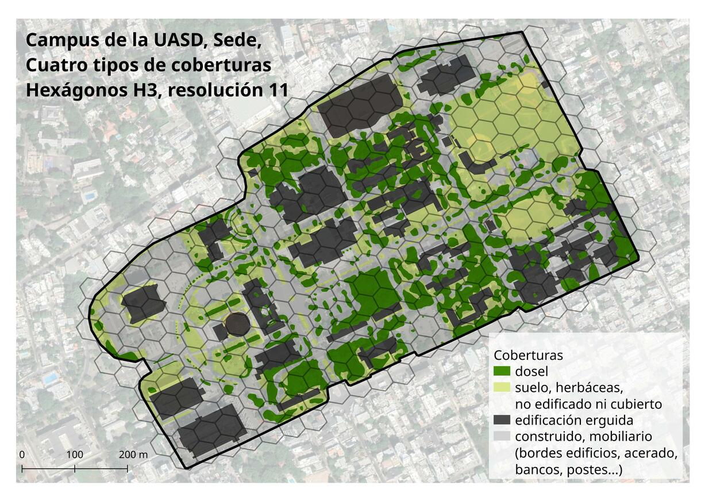

# Práctica 1. Mapa del campus de la UASD, Sede, cuatro tipos de coberturas, hexágonos H3, resolución 11

> Fecha de entrega: 15 de septiembre, 23:59 horas.

1. Observa el mapa a continuación:

2. Presta atención a los cuatro tipo de "coberturas". Si tienes dudas sobre alguno, hazme consulta. No hay mucho que documentarse sobre éstas coberturas, sólo que es importante que las puedas distinguir.

3. Presta atención a la malla, "cuadrícula" o índice de hexágonos H3. Documéntate [sobre ella](https://h3geo.org/), identifica qué es eso de las [resoluciones](https://h3geo.org/docs/core-library/restable), y que significa "resolución 11".

4. Intenta determinar el área del Campus, al menos del polígono central. Puedes hacer una aproximación, recurrir a herramientas de SIG, consultar en la web (cuidado aquí, que suele haber errores), o abrir el archivo [poligono-uasd.kml](fuentes/practica-01/poligono-uasd.kml) desde Google Earth o QGIS.

5. Tan pronto hayas comprendido cada una de las partes, redacta, en dos párrafos, una descripción del mapa en cuestión. No te preocupes si omites detalles técnicos o si no conoces en detalle las coberturas. Céntrate en describir lo que ves en el mapa, los patrones espaciales que ves en relación con dichos elementos.

6. Formula tres preguntas de investigación que entiendas se pueden resolver con el diseño mostrado en el mapa, asumiendo que colectarías hormigas en una selección de cinco hexágonos de coberturas variadas. Las preguntas deben poner en asociación "hábitats" y comunidad de hormigas.

## Definamos los criterios de evaluación

Elegimos cinco criterios de evaluación. Los destacados en negrita son los elegidos.

1. Claridad:

   - ¿La redacción y las preguntas son claras y fáciles de entender?
   - ¿El propósito de la pregunta de investigación está bien definido?

2. Relevancia:

   - ¿Se relacionan las preguntas directamente con los elementos morfológicos elegidos?
   - ¿Es relevante para el campo de la geomorfología?

3. Especificidad:

   - ¿Las preguntas son específicas como para guiar una investigación detallada?
   - ¿Evita preguntas vagas o demasiado generales?

4. Contexto teórico:

   - ¿La pregunta demuestra un entendimiento claro del contexto teórico y científico en el que se encuentra la geomorfología?
   - ¿Hace referencia a teorías o conceptos pertinentes?

5. Viabilidad y factibilidad:

   - ¿Las preguntas son abordables y pueden ser investigadas dentro de un marco de tiempo y recursos razonables?
   - ¿Considera las limitaciones prácticas de la investigación?

6. Originalidad e innovación:

   - ¿Las preguntas muestran un enfoque original o una perspectiva novedosa hacia los elementos morfológicos?
   - ¿Proponen nuevas ideas o enfoques?

7. Métodos de observación:

   - ¿Las preguntas sugieren métodos de observación apropiados para analizar los elementos morfológicos en cuestión?
   - ¿Consideran la disponibilidad de datos y herramientas?

8. Potencial de contribución:

   - ¿Las preguntas tienen el potencial de contribuir al conocimiento actual en geomorfología?
   - ¿Pueden generar información útil para la comunidad científica?

9. Redacción y estructura:

   - ¿La pregunta está redactada de manera clara y coherente?
   - ¿Sigue una estructura lógica y gramaticalmente correcta?

10. Creatividad y originalidad:

    - ¿Las preguntas demuestran creatividad en la formulación y enfoque de los elementos morfológicos?
    - ¿Presentan ideas novedosas o perspectivas únicas?

11. Impacto potencial:

    - ¿Se evidencia el potencial impacto de la investigación que se podría derivar de estas preguntas?
    - ¿Se pueden identificar posibles aplicaciones o implicaciones prácticas?

12. Conexión con objetivos personales o institucionales:
    - ¿Las preguntas de investigación se alinean con los objetivos personales o institucionales del investigador o del proyecto en curso?

## Usa esta escala de valoración

**Nivel 4 (Excelente)**:

- Se demuestra un profundo entendimiento del tema y del contexto teórico.
- La descripción realizada es excelente, y se explican de manera fluida la distribución y los patrones espaciales.
- Las preguntas son originales, claras, específicas, relevantes, y tienen potencial de contribución.

**Nivel 3 (Bueno)**:

- Se demuestra entendimiento del tema y algo del contexto teórico.
- La descripción realizada es legible, y se explican de forma aceptable la distribución y los patrones espaciales.
- Las preguntas son originales y específicas, pero les falta relevancia y potencial de contribución.

**Nivel 2 (Aceptable)**:

- Se demuestra algo de entendimiento del tema, y no se aporta contexto teórico.
- La descripción realizada no es fluida, y se explican de forma insuficiente la distribución y los patrones espaciales.
- Las preguntas no son originales ni específicas, y carecen de relevancia y potencial de contribución.

**Nivel 1 (En Desarrollo)**:

- No se demuestra entendimiento del tema, y no se aporta contexto teórico.
- En la descripción, sólo se explican detalles inconexos.
- Las preguntas presentadas son insuficientes.
